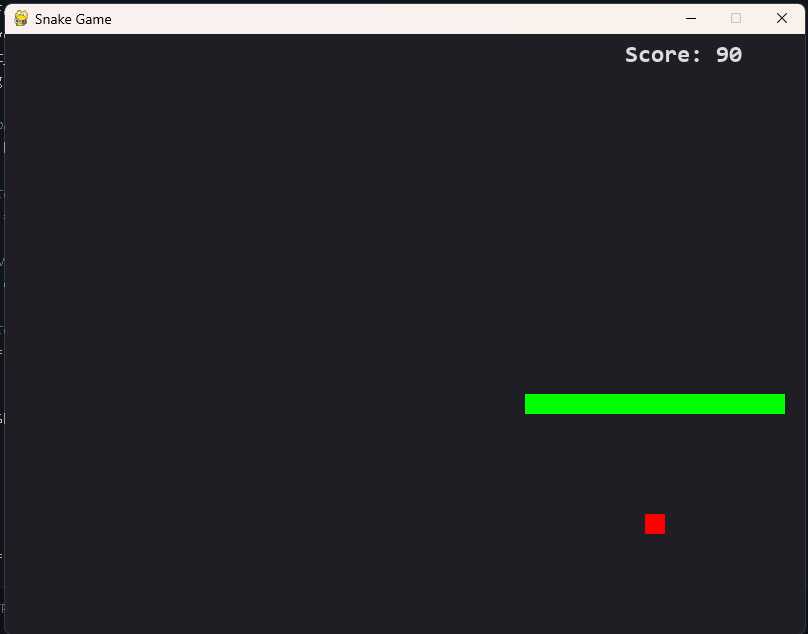
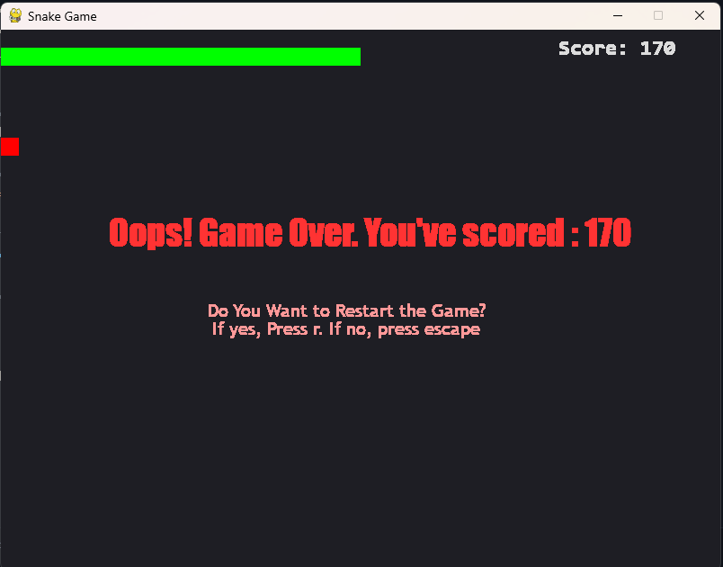

# 🐍 Snake Game 

A classic Snake Game built with Python and Pygame.


## Features

- Smooth snake movement
- Food spawning
- Snake growth
- Score counter
- Wall collision
- Self collision
- Restart option

## Screenshots

### Gameplay



*The snake collecting food while the current score is displayed.*

### Game Over



*The Game Over screen displayed after the snake collides with the wall or itself.*

## Technologies Used

- Python 3.13
- Pygame 2.6.1

## Installation

```bash
pip install -r requirements.txt
python snake.py
```

## Future Improvements

- Pause feature
- High score system
- Sound effects
- Difficulty levels

## Author

Lakshyarajsingh Chauhan
